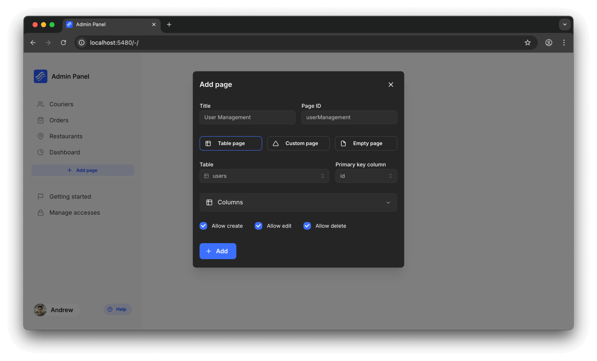

# Table pages

Kottster table pages let you **view and manage data** in your database tables.


**The table pages support a variety of actions, including:**

- Viewing records
- Creating, updating, and deleting records
- Filtering, searching and sorting
- Paginating results
- Viewing and selecting related records
- Creating, updating, and deleting related records

## Page structure

Each table page should have its own directory under `app/pages/<pageId>` containing two files. The `<pageId>` becomes the URL path where your page will be accessible (e.g., `/users` for a page in `./app/pages/users/`).

### Backend controller (`api.server.js`)
This file handles your table's backend logic and database interactions.

**Example:**

```js [app/pages/users/api.server.js]
import { app } from '../../_server/app';
import dataSource from '../../_server/data-sources/postgres';

// Default export the controller for handling table requests
const controller = app.defineTableController(dataSource, {
  rootTable: {
    table: 'users' // Specifies which database table this page manages
  }
});

export default controller;
```

### Frontend component (`index.jsx`)
This file defines your page's user interface.

**Example:**

```jsx [app/pages/users/index.jsx]
import { TablePage } from '@kottster/react'; 

export default () => (
  <TablePage />
);
```

The backend controller uses [`defineTableController`](./configuration/api.md) to configure the table including its name, primary key, and available actions like selecting, inserting, updating, and deleting records. The frontend component returns the [`TablePage`](../ui/table-page-component.md) component, which displays the table and forms.

The frontend part is tightly integrated with the backend controller, so you don't need to pass any additional parameters to the `TablePage` component. It automatically connects to the backend API defined in `api.server.js`.

## Creating table pages

You have two options for creating table pages:

### Option 1: Visual editor (recommended)

The fastest way to create table pages is using Kottster's visual editor. It connects to your database, analyzes tables and relationships, and generates fully functional pages with a single click.



When you use the visual editor, your `api.server.js` file will include an import for a `settings.json`:

```js [app/pages/users/api.server.js]
import { app } from '../../_server/app';
import dataSource from '../../_server/data-sources/postgres';
import pageSettings from './settings.json';

const controller = app.defineTableController(dataSource, {
  ...pageSettings,
  rootTable: {
    ...pageSettings.rootTable,
  }
});

export default controller;
```

The `settings.json` file contains your page configuration and is automatically managed by the visual editor. You can still override or customize the configuration directly in the `api.server.js` file if needed.

::: info
Please avoid editing the `settings.json` file manually. It exists solely for the visual editor to store your page settings. If you need to make changes, do so in the `api.server.js` file instead.
:::

### Option 2: Manual creation

For more control or custom requirements, you can manually create the two files (`api.server.js` and `index.jsx`) in your `./app/pages/<page-id>` directory using the structure shown above.

## Examples

Here are some live examples of table pages to see them in action:

* **Users table** - A basic table page for managing users  
  [Live demo](https://demo.kottster.app/users) | [Source code](https://github.com/kottster/live-demo/tree/main/app/pages/users)

* **Instructors table** - Features customized column display and formatting  
  [Live demo](https://demo.kottster.app/instructors) | [Source code](https://github.com/kottster/live-demo/tree/main/app/pages/instructors)

* **Payments table** - Shows extensive related data and complex relationships  
  [Live demo](https://demo.kottster.app/payments) | [Source code](https://github.com/kottster/live-demo/tree/main/app/pages/payments)